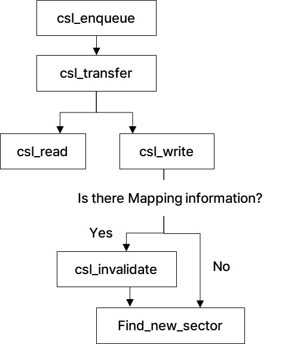
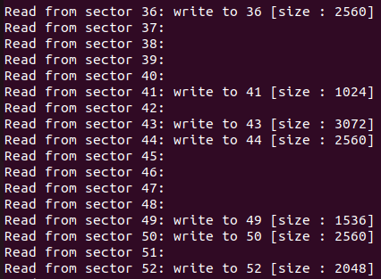
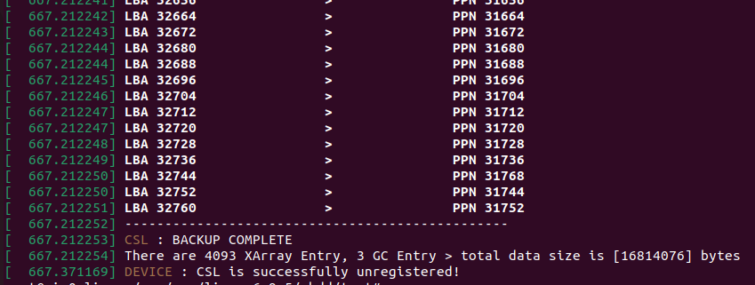
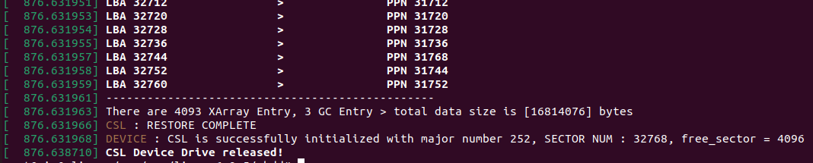
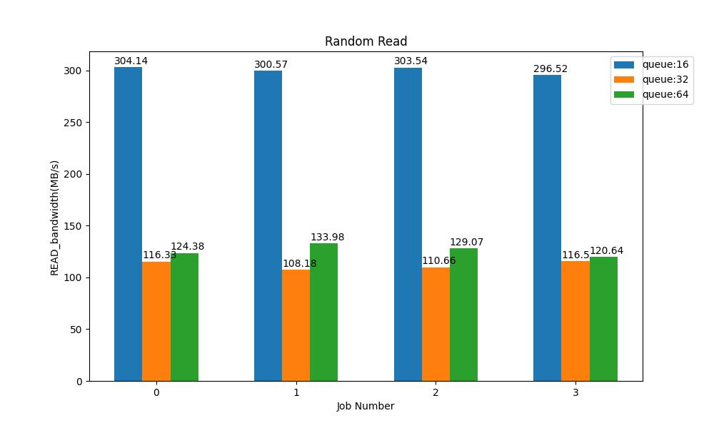
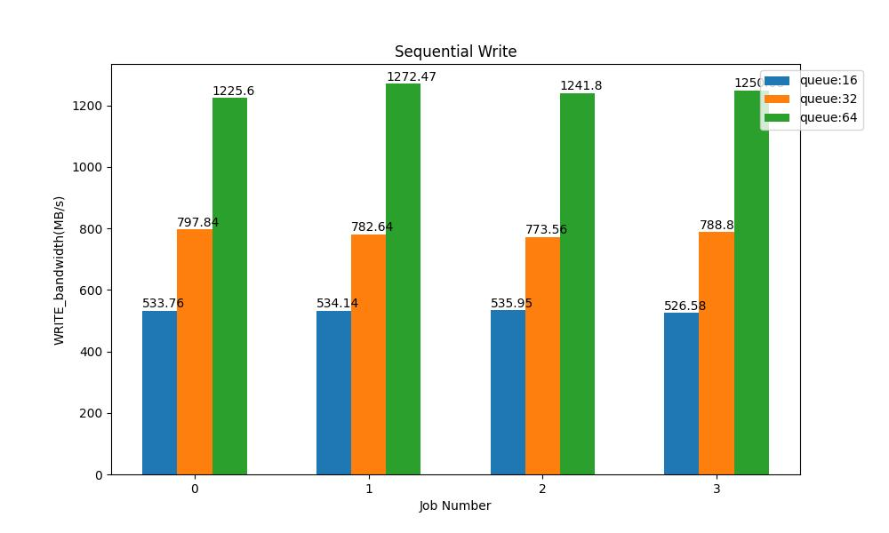
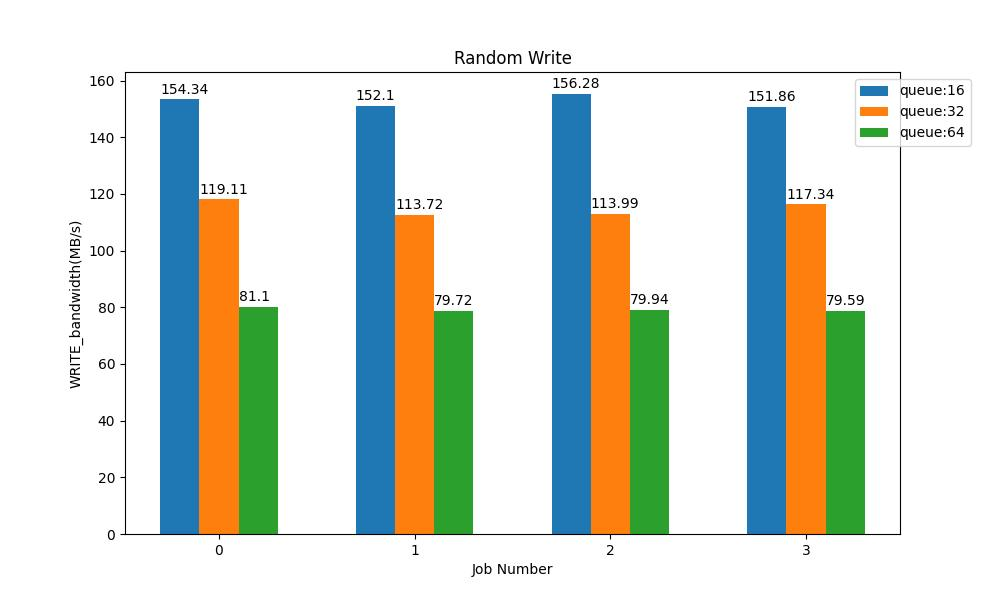

### Append_only Block Device Drive
###### MinyoungKim

#### 1. Structure

1) csl_dev

|name|description|
|----|---|
|request_queue *queue||
|Gendisk *gdisk||
|struct blk_mq_tagset *tag_set|
|Unsigned long *free_map|Manage free sectors in disk using bitmap|
|Struct list_head list|Invalidated sector list for garbage collection|
|Struct xarray l2p_map|XArray for mapping from Logical Block number to Physical page number|
|U8 *data|Actual data array|

2) operation



#### 2. Code for Read And Write

1) csl_enqueue


```c++
blk_status_t csl_enqueue(struct blk_mq_hw_ctx *ctx, const struct blk_mq_queue_data *data){
	struct request *rq = data->rq;
	
	blk_mq_start_request(rq);
	csl_get_request(rq); // Get Request and Fetch
	blk_mq_end_request(rq, BLK_STS_OK);

	return BLK_STS_OK;
}
```

2. csl_get_request

```c++

void csl_get_request(struct request *rq)
{
	
	int isWrite = rq_data_dir(rq);

	sector_t start_sector = blk_rq_pos(rq);
	
	struct bio_vec bvec;
	struct req_iterator iter;

	void* buffer;

	rq_for_each_segment(bvec, rq, iter){
		unsigned int num_sector = blk_rq_cur_sectors(rq); 

		buffer = page_address(bvec.bv_page)+bvec.bv_offset;

		csl_transfer(dev, start_sector, num_sector, buffer, isWrite); 

		start_sector += num_sector; 
	}
}

```

csl_get_request는 request를 가져와 각 request를 실행해준다. 

가장 먼저 해당 request가 read인지 write인지 확인한다.
그리고 blk_rq_pos로 최초 시작 sector를 가져온다. 
여러 요청이 병합되어 들어오므로 rq_for_each_segment를 통해서 각 request segment를 가져와 각각 실행해준다. 이때 rq_cur_sectors로 몇 개의 sector를 읽거나 써야할지 체크하고, start_sector를 업데이트한다.
또한, bvec의 page와 offset을 가져와 어디에서 데이터를 읽어오고, 또 써줘야 할지 fetch해서 가져올 수 있다.

fetch한 request는 csl_transfer에 전달되어 이후의 과정을 실행한다. 

3. csl_transfer

```c++

void csl_transfer(struct csl_dev *dev, unsigned int start_sec, unsigned int num_sec, void* buffer, int isWrite){

	struct l2b_item* l2b_item;
	void* ret;

	unsigned int ppn_new; 
	int final_ppn;

	if(isWrite){
		// check is there allocated sector
		ret = xa_load(&dev->l2p_map, (unsigned long)start_sec);
		
		if(!ret){
			// There is no allocated sector 
			final_ppn = csl_write(buffer, num_sec);
			if(final_ppn <0) return;

			// Store new mapping information
			l2b_item = kmalloc(sizeof(struct l2b_item), GFP_KERNEL);

			if(IS_ERR(l2b_item) || l2b_item == NULL){
				pr_warn(MALLOC_ERROR_MSG);
				return;
			}

			l2b_item->lba = start_sec;
			l2b_item->ppn = final_ppn;

			xa_store(&dev->l2p_map, l2b_item->lba, (void*)l2b_item, GFP_KERNEL);
		}

		else{
			// There is allocated sector for that logical address
			// We should invalidate it
			l2b_item = (struct l2b_item*) ret;
			unsigned int ppn_old = l2b_item->ppn;
			
			final_ppn = csl_write(buffer, num_sec);
			
			if(final_ppn<0) return;
			
			// Update mapping information
			l2b_item->ppn = final_ppn;

			// Invalidate existing ppn
			csl_invalidate(ppn_old);

		}
	}

	else {
		// Just find Mapping information and read it
		ret = xa_load(&dev->l2p_map, start_sec);
		if(IS_ERR(ret) || ret == NULL){
			return;
		}
		l2b_item = (struct l2b_item*) ret;
		csl_read(l2b_item->ppn, buffer, num_sec);
	}
}
```

csl_transfer는 Write, Read에 맞춰 동작을 수행한다.

우선, write operation의 경우 가장 먼저 XArray에서 mapping information이 있는지 확인한다.
mapping information이 없다면, csl_write를 수행해 데이터를 쓰고 기록된 ppn address를 받아와 새로운 mapping information을 저장해준다.
mapping information이 있다면, csl_write를 수행하고, 새롭게 쓰인 ppn으로 업데이트를 수행한 후 기존의 ppn은 invalidate 해준다. 

Read Operation의 경우, XArray에서 mapping information을 찾고 이를 이용해 csl_read를 수행한다. 


4. csl_read()

```c++

void csl_read(uint ppn, void* buf, uint num_sec)
{
	uint nbytes = num_sec * SECTOR_SIZE;

	if (ppn >= DEV_SECTOR_NUM){
		printk(KERN_WARNING "Wrong Sector num!");
		return;	
	}

	memcpy(buf, dev->data+(ppn*SECTOR_SIZE), nbytes);
}
```

csl_read는 ppn을 받아 해당 위치의 데이터를 buffer에 저장해준다. 
ppn이 sector number를 초과하는지 확인해주고, 알맞은 ppn이라면 memcpy를 이용해 device의 data를 buffer에 복사해 read를 수행한다. 

5. csl_write()

```c++

unsigned int csl_write(void* buf, uint num_sec)
{
	uint ppn;
	uint nbytes = num_sec * SECTOR_SIZE;

	ppn = find_free_sector(num_sec);

	if (ppn >= DEV_SECTOR_NUM || ppn >= MAX_INT){
		// garbage collection 수행
		uint ppn_new = csl_gc();
		if(ppn_new >= MAX_INT){
			// pr_warn("CSL : There is no capacity in device");
			return FAIL_EXIT;
		}
		memcpy(dev->data+(ppn_new*SECTOR_SIZE), buf, nbytes);
		return ppn_new; 
	}

	memcpy(dev->data+(ppn*SECTOR_SIZE), buf, nbytes);

	return ppn;	
}

```

csl_write는 가장 먼저 find_free_sector를 이용해 데이터가 쓰여질 ppn을 받아온다. 
이때, find_free_sector의 값을 확인해 valid한지 확인하고, valid하다면 해당 주소에 data를 기록한다. 만약, invalid한 ppn을 가져왔다면, 이는 device에 free sector가 없다는 것을 의미하므로 garbage collection을 수행해 ppn을 가져온다. 그리고 그 ppn에 data를 기록한다.
두 경우 모두 데이터가 쓰여지기 시작한 ppn을 반환한다. 

6. csl_invalidate()

```c++
void csl_invalidate(unsigned int ppn)
{
	struct list_item *item;

	item = kmalloc(sizeof(struct list_item), GFP_KERNEL);

	if(IS_ERR(item) || item == NULL) {
		pr_warn("CSL : Fail To Allocate list item !");
		return;
	}

	item->sector = ppn;
	list_add_tail(&item->list_head, &dev->list);
	
}
```

csl_invalidate는 ppn을 인자로 받아 해당 ppn을 garbage collection list에 넣어준다.
이때, 해당 ppn에 쓰여진 data는 굳이 지우지 않아도, 추후 다시 write되면서 덮이기 때문에 단순히 garbage collection list에 넣는 것으로 동작을 완료한다. 

7. find_free_sector

```c++
unsigned long find_free_sector(unsigned int size)
{
	if(bitmap_full(dev->free_map, DEV_SECTOR_NUM)) return FAIL_EXIT;

	unsigned long bit;

	bit = bitmap_find_next_zero_area(dev->free_map, DEV_SECTOR_NUM, 0, size, 0);
	bitmap_set(dev->free_map, bit, size);

	return bit;
}
```

dev의 free map에서 빈 sector를 찾아 반환한다. 
size만큼의 빈 sector를 찾고 bitmap_set을 이용해 사용중임을 표시한다.
만약, 모든 bit가 set되어 있다면 -1(0xFFFF)를 반환한다. 


#### 3. Code for Backup

해당 device는 remove 되어질 때 크게 두 가지의 데이터를 백업해야 한다.
a) metadata : Bitmap, XArray, GC List
b) Data Array
두 정보를 linear하게 쌓아 binary file로 만들어 저장한 후 이를 읽어오는 방식으로 backup operation을 구현했다.

1. CSL_backup()

```c++

void csl_backup(struct csl_dev *dev)
{
	unsigned int xa_entry_num=0;
	unsigned int gc_entry_num=0;
	unsigned int *metadata_ptr;

	void *data_ptr;
	struct list_item *litem;
	struct l2b_item* xa_item;

	u8 *total_data;
	unsigned int total_data_size = 0;

	// 1. Get the number of XArray entry.
	void* xa_ret;
	unsigned long idx;
	if(!xa_empty(&dev->l2p_map)){
		xa_for_each(&dev->l2p_map, idx, xa_ret){
			xa_entry_num++;
		}
	}
	
	// 2. Get the number of Linked List entry.
	if(!list_empty(&dev->list)){
		gc_entry_num = list_count_nodes(&dev->list);
	}
	
	
	// 3. Make a array for store data and copy header data
	total_data_size = BACKUP_HEADER_SIZE + (xa_entry_num * XA_ENTRY_SIZE) + (gc_entry_num * GC_ENTRY_SIZE) + DEVICE_TOTAL_SIZE;
	total_data = vmalloc(total_data_size);
	
	if(IS_ERR(total_data) || total_data < 0 || total_data == NULL){
		pr_info(MALLOC_ERROR_MSG);
		return;
	}
	
	memcpy(total_data, dev->free_map, FREE_MAP_SIZE);
	memcpy(total_data + FREE_MAP_SIZE, &xa_entry_num, sizeof(xa_entry_num));
	memcpy(total_data + FREE_MAP_SIZE + sizeof(xa_entry_num), &gc_entry_num, sizeof(gc_entry_num));
	
	// 4. Copy XArray, Linked List value 
	metadata_ptr = (unsigned int *)(total_data + BACKUP_HEADER_SIZE);

	xa_for_each(&dev->l2p_map, idx, xa_ret){
		xa_item = (struct l2b_item*)xa_ret;
		*metadata_ptr++ = (unsigned int)xa_item->lba;;
		*metadata_ptr++ = xa_item->ppn;
	}
	
	metadata_ptr = (unsigned int*)(total_data + BACKUP_HEADER_SIZE + xa_entry_num * XA_ENTRY_SIZE);
	
	list_for_each_entry(litem, &dev->list, list_head){
		*metadata_ptr++ = litem->sector;
	}
	
	// 5. Copy Actual data array
	data_ptr = total_data + BACKUP_HEADER_SIZE + (xa_entry_num * XA_ENTRY_SIZE) + (gc_entry_num * GC_ENTRY_SIZE);
    memcpy(data_ptr, dev->data, DEVICE_TOTAL_SIZE);

	if (write_to_file(BACKUP_FILE_PATH, total_data, total_data_size) < 0) {
        pr_warn(FILE_WRITE_ERROR_MSG);
		return;
    }

	vfree(total_data);

	display_index();
	
	pr_info("CSL : BACKUP COMPLETE");
	pr_info("There are %d XArray Entry, %d GC Entry > total data size is [%d] bytes", xa_entry_num, gc_entry_num, total_data_size);
}
```

CSL module을 제거할 때 해당 함수를 호출해 device backup을 수행한다.

가장 먼저, XArray의 entry 개수, GC List의 entry 개수를 count하고 데이터를 기록하기 위한 공간을 할당받는다.
두 번째로 Bitmap, XArray entry 개수, gc entry 개수를 저장한다.
그 다음, XArray의 LBA, PPN을 각각 int로 변환해 저장하고, gc entry도 ppn 값만 가져와 배열에 저장한다. 
마지막으로 실제 data를 가져와 저장하고 해당 array를 write_to_file을 이용해 파일로 저장해준다.

이로써 CSL device backup을 수행할 수 있다. 


2. CSL_restore()

```c++
void csl_restore(struct csl_dev *dev)
{
	int i;

	unsigned int xa_entry_num = 0;
	unsigned int gc_entry_num = 0;
	unsigned int *metadata_ptr;
	u8 *data_ptr;

	unsigned int offset;

	struct l2b_item* l2b_item;
	struct list_item* item;

	u8 *total_data;
	unsigned int total_data_size;

	// 1. Read offset, the number of each xarray and list entry
	
	void* header_data = kmalloc(BACKUP_HEADER_SIZE, GFP_KERNEL);
	
	if(IS_ERR(header_data) || header_data == NULL){
		pr_warn();
		goto nofile;
	}

	if(read_from_file(BACKUP_FILE_PATH, header_data, BACKUP_HEADER_SIZE)<0){
		pr_warn(FILE_READ_ERROR_MSG);
		goto nofile;
	}

	memcpy(dev->free_map, header_data, FREE_MAP_SIZE);

	xa_entry_num = *(unsigned int*)(header_data + FREE_MAP_SIZE);
	gc_entry_num = *(unsigned int*)(header_data + FREE_MAP_SIZE + sizeof(xa_entry_num));
	
	total_data_size = BACKUP_HEADER_SIZE + (xa_entry_num * XA_ENTRY_SIZE) + (gc_entry_num * GC_ENTRY_SIZE) + DEVICE_TOTAL_SIZE;
	
	total_data = vmalloc(total_data_size);

	if(read_from_file(BACKUP_FILE_PATH, total_data, total_data_size) < 0){
		pr_warn(FILE_READ_ERROR_MSG);
		goto nofile;
	}
	
	// 2. Read XArray Data

	metadata_ptr = (unsigned int*)(total_data + BACKUP_HEADER_SIZE);
	
	xa_init(&dev->l2p_map);

	for(i = 0; i < xa_entry_num; i++){
		l2b_item = kmalloc(sizeof(struct l2b_item), GFP_KERNEL);
		if(IS_ERR(l2b_item) || l2b_item == NULL){
			pr_warn();
			goto nofile;
		}
		l2b_item->lba = (unsigned long)(*metadata_ptr++);
		l2b_item->ppn = *metadata_ptr++;

		xa_store(&dev->l2p_map, l2b_item->lba, (void*)l2b_item, GFP_KERNEL);
	}


	// 3. Read Linked List Data 
	
	INIT_LIST_HEAD(&dev->list);
	for(i = 0; i < gc_entry_num; i++){
		item = kmalloc(sizeof(struct list_item), GFP_KERNEL);
		if(IS_ERR(item) || item == NULL){
			pr_warn();
			goto nofile;
		}
		item->sector = *metadata_ptr++;
		list_add_tail(&item->list_head, &dev->list);
	}
	
	// 4. Read Actual Data

	data_ptr = (u8*)metadata_ptr;
	memcpy(dev->data, data_ptr, DEVICE_TOTAL_SIZE);
	
	vfree(total_data);
	display_index();
	pr_info("CSL : RESTORE COMPLETE");
	return;

nofile:
	pr_warn(BACKUP_FAIL_MSG);
	xa_init(&dev->l2p_map);
	INIT_LIST_HEAD(&dev->list);
	bitmap_zero(dev->free_map, DEV_SECTOR_NUM);
	return;
}
```

device의 정보를 하나씩 백업한다. 

우선, 백업 파일이 있는지 체크한 후, 없다면 device의 XArray, bitmap, gc List를 초기화한 후 종료한다. 

백업 파일이 있다면, 가장 먼저 header data를 읽어 bitmap, XArray, gc List의 entry 개수를 가져온다. 
그리고 각 개수에 맞춰서 데이터를 읽어오며 각각 XArray와 GC List에 해당 데이터들을 저장해준다.
마지막으로 data array를 읽어와 저장해주면 device restore가 종료된다. 

#### 4. Example

실제 다양한 operation을 수행하며 debug Message를 출력해 위와 같은 device operation이 제대로 작동하는 것을 확인하였다. 

1. read & write test

```c++
#include <stdio.h>
#include <stdlib.h>
#include <string.h>
#include <fcntl.h>
#include <unistd.h>
#include <errno.h>
#include <time.h>

#define BUF_LEN      4096 // 8 sector
#define DEV_NAME     "/dev/CSL"
#define DEV_SIZE     (16*1024*1024) // 16 MB
#define SECTOR_SIZE  512
#define MAX_SECTORS  (DEV_SIZE / SECTOR_SIZE)
#define START_SECTOR 1
#define END_SECTOR   DEV_SIZE/SECTOR_SIZE -1

int main() {
    static char buf[BUF_LEN];
    int fd;
    off_t off;

    printf("Start to test\n");

    if ((fd = open(DEV_NAME, O_RDWR)) < 0) {
        perror("open error");
        return 1;
    }

    srand(time(NULL));

    for (int i = 0; i < 10000; i++) {

        int rand_sector = START_SECTOR + rand() % (END_SECTOR - START_SECTOR);
        int rand_size = (rand() % (BUF_LEN / SECTOR_SIZE) + 1) * SECTOR_SIZE;

        off = (off_t) rand_sector * SECTOR_SIZE;

        if (lseek(fd, off, SEEK_SET) < 0) {
            perror("lseek error");
            close(fd);
            return 1;
        }

        snprintf(buf, rand_size, "write to %d [size : %d]", rand_sector, rand_size);
        // printf("write to %d : %s [size : %d]\n", rand_sector, buf, rand_size);

        if (write(fd, buf, rand_size) < 0) {
            perror("Write Error");
            close(fd);
            return 1;
        }
    }

    close(fd);
    return 0;
}

```
위와 같은 write test로 총 만 번의 random size write를 수행하는 test를 수행하였다.

```c++
#include <stdio.h>
#include <stdlib.h>
#include <string.h>
#include <fcntl.h>
#include <unistd.h>
#include <errno.h>

#define BUF_LEN      512 // 8 sector
#define DEV_NAME     "/dev/CSL"
#define SECTOR_SIZE  512
#define START_SECTOR 10
#define END_SECTOR   100

int main() {
    static char buf[BUF_LEN];
    int fd;
    off_t off;

    printf("Start to read test\n");

    if ((fd = open(DEV_NAME, O_RDONLY)) < 0) {
        perror("open error");
        return 1;
    }

    for (int i = START_SECTOR; i <= END_SECTOR; i++) {
        off = (off_t)i * SECTOR_SIZE;

        if (lseek(fd, off, SEEK_SET) < 0) {
            perror("lseek error");
            return 1;
        }

        memset(buf, 0, sizeof(buf)); // 버퍼 초기화
        if (read(fd, buf, sizeof(buf)) < 0) {
            perror("read error");
            return 1;
        }

        printf("Read from sector %d: %s\n", i, buf);
    }

    if (close(fd) != 0) {
        perror("close error");
    }

    printf("Read test complete\n");

    return 0;
}
```
그리고 위의 read 프로그램을 호출해 10~100번 sector까지를 훑으며 제대로 write가 되었는지를 각각 검사하였다. 



이와 같이 쓴 내용이 잘 저장되었고, 이를 잘 읽어오는 것을 확인할 수 있다. 

2. Backup test

위의 실험을 이어, backup 과 restore가 잘 수행되는지 확인하였다.  

먼저 rmmod를 하고 dmesg를 확인하면 아래와 같은 정보들을 확인할 수 있다.



display_index를 통해 mapping information을 출력하고, 총 몇개의 XArray, GC list entry가 있는지를 보여준다.

이후 다시 module을 insert하고 디버그 메시지를 확인한 결과는 다음과 같다.



모듈을 제거할 때와 같은 정보가 잘 로드되어 온 것을 확인할 수 있다.
이렇게 모듈을 다시 insert한 뒤 read test를 진행하면, 앞에서 write한 정보가 그대로 들어있음을 확인하였다. 

#### 5. FIO Test Result

Block device CSL fio Test를 진행하였다.

```shell
RUNTIME=30s
NUMJOBS=1
SIZE=8m
RAMP=5s
IOENGINE=io_uring
DIRECT=1
VERIFY=0
FILE_NAME="/dev/CSL"

TYPE=("read" "write" "randread" "randwrite")
BLOCK_SIZES=("512B")
IO_DEPTHS=("16" "32" "64")

run_fio_test(){
	local bs=$1
	local output_file=$2
	local rwtype=$3
	local io_depth=$4

	sudo fio --filename=$FILE_NAME --name=fio_test --size=$SIZE --time_based --runtime=$RUNTIME --ramp_time=$RAMP \
		--ioengine=$IOENGINE --direct=$DIRECT --verify=$VERIFY --bs=$bs --iodepth=$io_depth \
		--rw=$rwtype --numjobs=$NUMJOBS --output-format=csv --output=$output_file
}

for bs in "${BLOCK_SIZES[@]}"; do
	for rwtype in "${TYPE[@]}"; do
		for io_depth in "${IO_DEPTHS[@]}"; do
	       		output_file="./result/fio_${bs}_${rwtype}_${io_depth}.csv"
			echo "Running fio test with blk size $bs and type $rwtype and depth $io_depth"
 			run_fio_test $bs $output_file $rwtype $io_depth
		done
	done
done

echo "FIO TEST COMPLETE"

```

위와 같은 Shell scpript를 이용해서 block size 512B, 4개의 쓰레드로 고정을 시킨 후 io_queue depth에 따른 bandwidth 결과를 분석하였다. 

###### a. Sequential read


위의 그림은 fio_read의 result를 나타낸다.
Queue Depth가 증가함에 따라 성능이 증가함을 확인할 수 있고, 가장 성능이 좋을 땐 약 1GB의 성능을 보이고 있다. 


위의 그림은 fio_random read의 result를 나타낸다.
Queue Depth가 증가하면 오히려 성능이 크게 하락됨을 확인할 수 있다. 
이는 Sequential Read와 다르게 메모리의 캐시를 제대로 사용하지 못 하는 결과로 보여진다.
Virtual Block device의 특성 상 해당 device에 접근하는 것이 물리적으론 컴퓨터의 메모리에 접근하는 것이 되므로, 메모리의 캐시를 이용할 것이다.
Sequential operation에서는 메모리 캐시의 hit rate가 상당히 높을 것이고 이를 활용해 빠르게 operation을 수행해 queue depth의 깊이가 증가할수록 더 많은 요청을 처리할 수 있다. 하지만, random operation의 경우 캐시를 제대로 활용할 수 없으므로 오히려 queue가 증가할 수록 queue를 관리하고 이를 스케줄링 하는 오버헤드가 더 커져 성능이 더 떨어지는 것으로 추측된다. 



위의 그림은 fio write의 result를 나타낸다.
sequential read operation과 비슷하게 queue depth가 증가할수록 성능이 좋아지는 것을 확인할 수 있다. 
약 500MB ~ 1GB의 성능을 보이고 있다. 



위의 그림은 fio random write의 result를 나타낸다. 
앞서 이야기하였듯 random operation의 특성 상 메모리 캐시를 제대로 활용하지 못해 sequential write에 비해 현저히 성능이 떨어지는 것으로 예측된다. 

